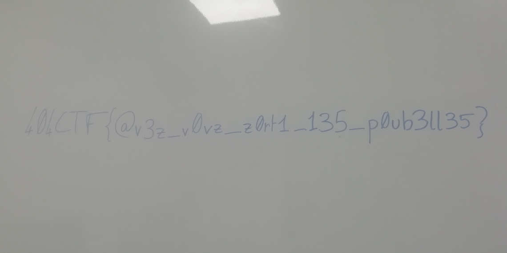

# FLOPPY

## Target acquired

On commence par regarder notre cible

```bash
file floppy.img
```

il nous réponds ceci:

```bash
floppy.img: DOS/MBR boot sector, code offset 0x3c+2, OEM-ID "MSDOS5.0", root entries 224, sectors 2880 (volumes <=32 MB), sectors/FAT 9, sectors/track 18, reserved 0x1, serial number 0x1eeb92d8, unlabeled, FAT (12 bit), followed by FAT
```

On a donc une partion FAT, on va donc pouvoir la monter

```bash
mount -o loop floppy.img /mnt
```

Nous découvrons les fichiers suivants dans le répertoire de montage:

```bash
total 208K
drwxr-xr-x 2 root root 7,0K  1 janv.  1970 .
drwxr-xr-x 1 root root  102  8 avril 16:55 ..
-rwxr-xr-x 1 root root  70K  7 mai   04:58 IMG_0001.jpg
-rwxr-xr-x 1 root root  49K  7 mai   04:58 IMG_0002.jpg
-rwxr-xr-x 1 root root  67K  7 mai   04:59 IMG_0004.jpg
-rwxr-xr-x 1 root root  16K  7 mai   04:59 IMG_0005.jpg
```

Étrangement il semble manquer le fichier IMG_0003.jpg, nous allons confirmer sa suppression avec fls (inclus dans autopsy):

```bash
fls floppy.img
```

```bash
r/r 4:	IMG_0001.jpg
r/r 6:	IMG_0002.jpg
r/r * 8:	IMG_0003.jpg
r/r 10:	IMG_0004.jpg
r/r 12:	IMG_0005.jpg
d/d * 14:	.Trash-1000
v/v 45779:	$MBR
v/v 45780:	$FAT1
v/v 45781:	$FAT2
V/V 45782:	$OrphanFiles
```

W00T W00T, la 3eme ligne confirme ce que nous pensions, nous avons bien un fichier IMG_0003.jpg qui a été supprimé.

## Your time has come

C'est parti pour la récupération, toujours avec un outil tiré d'autopsy, nous allons cat le fichier supprimé

```bash
icat -o 0 floppy.img 8 > IMG_0003.jpg
```

Nous trouvons donc le résultat suivant:


